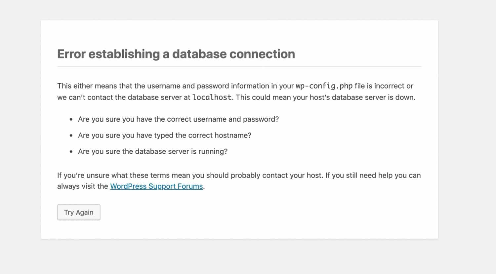

# Hybrid WordPress Application on AWS with On-Premises Database

## Overview

This GitHub repository contains the necessary files and scripts to set up a hybrid WordPress application. In this configuration, the WordPress application runs on AWS, while the database is hosted on-premises using vSphere for compliance reasons. The connection between them is secured using a reverse SSH tunnel.

## Table of Contents

- [Prerequisites](#prerequisites)
- [AWS part of the project](#AWS-part-of-the-project)
- [Configuration of Database](#configuration-of-database)
- [Reverse-SSH](#reverse-ssh)
- [Make sure that all done](#make-sure-that-all-done)


## Prerequisites

Before setting up the hybrid WordPress application, ensure you have the following:

- AWS account with necessary permissions
- On-premises server with vSphere (your pc with virtualization tool will be fine ex. virtualbox, docker) hosting the database
- Internet connection on your on-premises servers

## AWS-part-of-the-project

1. Clone this repository to your aws machine:

   ```bash
   git clone https://github.com/yourusername/hybrid-wordpress-aws-onprem.git
   cd hybrid-wordpress-aws-onprem
2. run this line to make the file `wordpressdeployment.sh' executable.
   ```bash
   chmod +x wordpressdeployment.sh
   ```

3. execute `the wordpressdeployment.sh` file
   ```bash
   ./wordpressdeployment.sh
   ```
4. modify the /var/www/html/wp-config to make it like this
   ```php
   // wp-config.php

   define('DB_NAME', 'wordpress');
   define('DB_USER', 'wordpress');
   define('DB_PASSWORD', 'password');
   define('DB_HOST', 'localhost:port-for-reverse-ssh');
   ```
    if you tried to connect to the web page via public ip this page will appear.
 

5. Open port `port-for-reverse-ssh` in the security group of the EC2.

our work with aws is done.


## Configuration of Database

1. Clone this repository to your on-prem VM:
   ```bash
   git clone https://github.com/yourusername/hybrid-wordpress-aws-onprem.git
   cd hybrid-wordpress-aws-onprem
   ```
2. run this line to make the script executable.
   ```bash
   chmod +x databasescript.sh
   ```
3. execute `the wordpressdeployment.sh` file
   ```bash
   ./databasescript.sh
   ```
4. open `etc/mysql/mariadb.conf.d/50-server.cnf` file and comment this line
   ```bash
   bind IP 127.0.0.1
   ```
if you tried to connect to the web page via public ip this page will appear.

 

4. Open port `port-for-reverse-ssh` in the security group of the EC2.

## Reverse-ssh

    run this command on your VM (DB) :
   ```bash
   ssh -i "key-path" port-for-reverse-ssh:localhost:3306 user@EC2-IP -N -R
   ```
   `key-path`: provide the EC2 key file path

   `port-for-reverse-ssh` : the port that opened on **security group** on AWS

   `user` : the user on EC2 

   `EC2-IP` : the public IP of EC2 instance
## Make sure that all done
write the `http://public-ip` in your browser. This window should appear

  
### Support and Issues
If you encounter any issues or have questions, please open an issue on this GitHub repository. We'll do our best to assist you.

Happy coding!